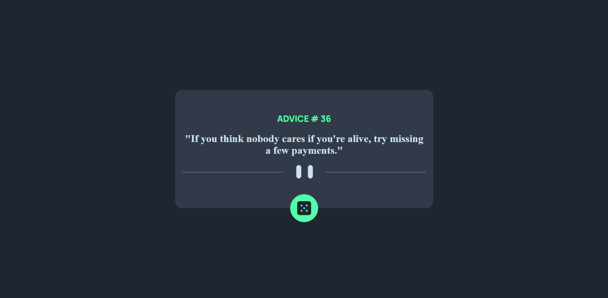
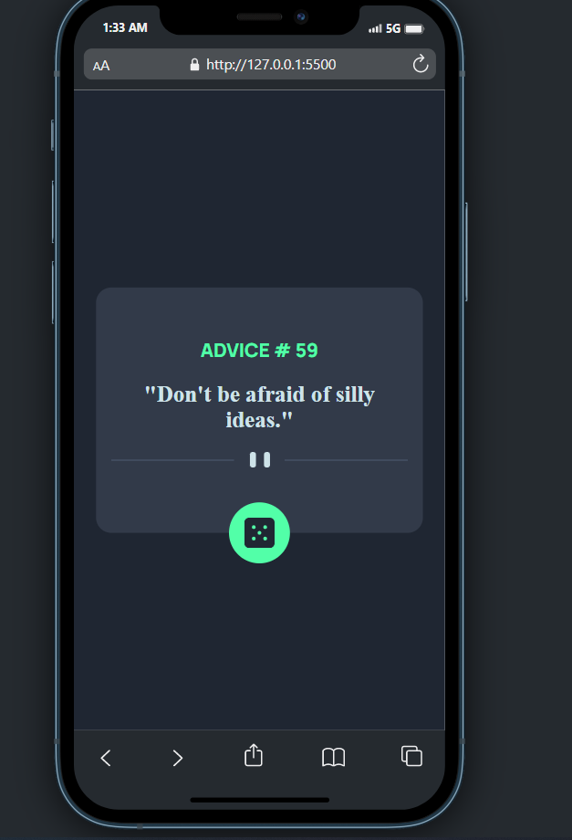

# Frontend Mentor - Advice generator app solution

This is a solution to the [Advice generator app challenge on Frontend Mentor](https://www.frontendmentor.io/challenges/advice-generator-app-QdUG-13db). Frontend Mentor challenges help you improve your coding skills by building realistic projects.

## Table of contents

- [Overview](#overview)
  - [The challenge](#the-challenge)
  - [Screenshot](#screenshot)
  - [Links](#links)
- [My process](#my-process)
  - [Built with](#built-with)
  - [What I learned](#what-i-learned)
  - [Continued development](#continued-development)
- [Author](#author)

## Overview

### The challenge

Users should be able to:

- View the optimal layout for the app depending on their device's screen size
- See hover states for all interactive elements on the page
- Generate a new piece of advice by clicking the dice icon

### Screenshot

### Links

- Solution URL: [Solution URL](https://github.com/ahmedfekry/ahmedfekry.github.io/tree/master/FrontendMentor/advice-generator-app-main)
- Live Site URL: [Live site](https://ahmedfekry.github.io/FrontendMentor/advice-generator-app-main/)

## my-process

### Built with

- Semantic HTML5 markup
- CSS custom properties
- CSS Grid
- Mobile-first workflow
- Jquery

### What I learned

revisited css grid and jquery

### Continued development

will keep practicing more & more & more

## Author

- Frontend Mentor - [@ahmedfekry](https://www.frontendmentor.io/profile/ahmedfekry)
- Twitter - [@ahmedfikry78](https://twitter.com/ahmedfikry78)
