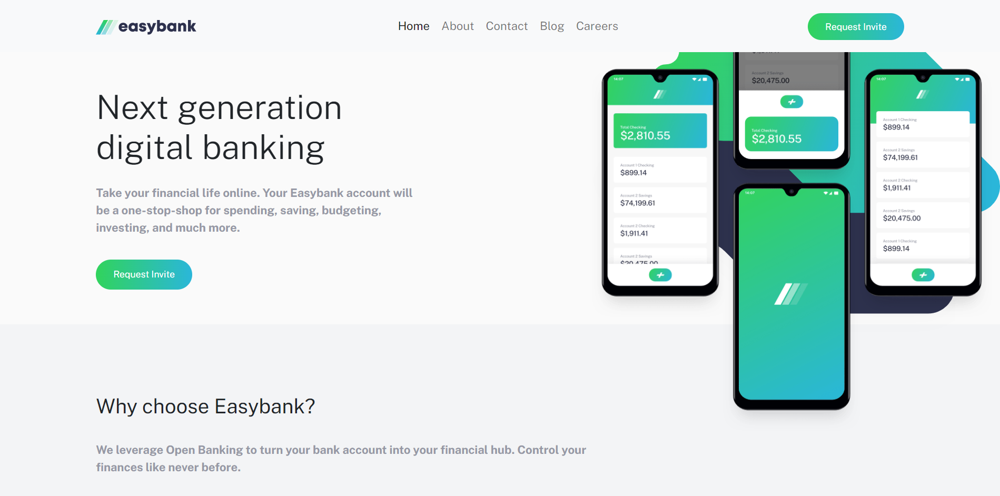
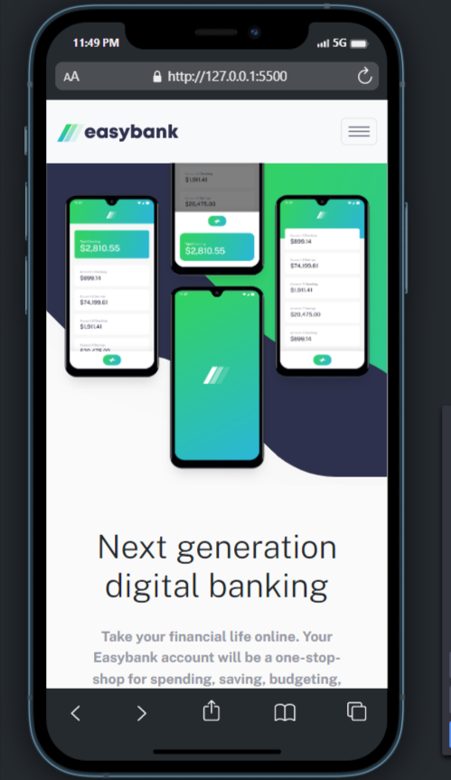

# Frontend Mentor - Easybank landing page solution

This is a solution to the [Easybank landing page challenge on Frontend Mentor](https://www.frontendmentor.io/challenges/easybank-landing-page-WaUhkoDN). Frontend Mentor challenges help you improve your coding skills by building realistic projects. 

## Table of contents

- [Overview](#overview)
  - [The challenge](#the-challenge)
  - [Screenshot](#screenshot)
  - [Links](#links)
- [My process](#my-process)
  - [Built with](#built-with)
  - [What I learned](#what-i-learned)
  - [Continued development](#continued-development)
- [Author](#author)

## Overview

### The challenge

Users should be able to:

- View the optimal layout for the site depending on their device's screen size
- See hover states for all interactive elements on the page

### Screenshot

### Links

- Solution URL: [Solution URL](https://ahmedfekry.github.io/FrontendMentor/easybank-landing-page-master/)
- Live Site URL: [Live site](https://your-live-site-url.com)

## My process

### Built with

- Semantic HTML5 markup
- CSS custom properties
- Flexbox
- CSS Grid
- Mobile-first workflow
- bootstrap 5.2

### What I learned

  learned more about bootstrap and how to override boostrap navbar style and how to play around with background
  
### Continued development

  Will keep more practicing
## Author

- Frontend Mentor - [@ahmedfekry](https://www.frontendmentor.io/profile/ahmedfekry)
- Twitter - [@ahmedfikry79](https://twitter.com/ahmedfikry78)
