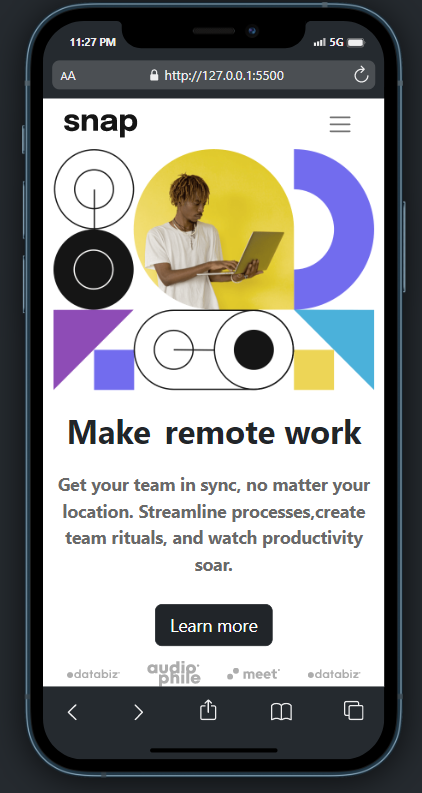

# Frontend Mentor - Intro section with dropdown navigation solution

This is a solution to the [Intro section with dropdown navigation challenge on Frontend Mentor](https://www.frontendmentor.io/challenges/intro-section-with-dropdown-navigation-ryaPetHE5). Frontend Mentor challenges help you improve your coding skills by building realistic projects. 

## Table of contents

- [Overview](#overview)
  - [The challenge](#the-challenge)
  - [Screenshot](#screenshot)
  - [Links](#links)
- [My process](#my-process)
  - [Built with](#built-with)
  - [What I learned](#what-i-learned)
  - [Continued development](#continued-development)
  - [Useful resources](#useful-resources)
- [Author](#author)
- [Acknowledgments](#acknowledgments)

## Overview

### The challenge

Users should be able to:

- View the relevant dropdown menus on desktop and mobile when interacting with the navigation links
- View the optimal layout for the content depending on their device's screen size
- See hover states for all interactive elements on the page

### Screenshot

### Links

- Solution URL: [Solution URL](https://github.com/ahmedfekry/ahmedfekry.github.io/tree/master/FrontendMentor/intro-section-with-dropdown-navigation-main)
- Live Site URL: [live site URL](https://ahmedfekry.github.io/FrontendMentor/intro-section-with-dropdown-navigation-main/)

## My process

### Built with

- Semantic HTML5 markup
- CSS custom properties
- Flexbox
- CSS Grid
- Mobile-first workflow
- Bootstrap 5.2.3

### What I learned

I Learned more on bootstrap and how to use already made components and how to use the grid system.

### Continued development

Will continue learning and practicing on bootstrap and it is built in grid system.

### Useful resources

- [Bootstrap 5 Course on net ninja channel](https://www.youtube.com/playlist?list=PL4cUxeGkcC9joIM91nLzd_qaH_AimmdAR) - This helped me in learning what is bootstrap and how to use it in modern browsers

## Author

- Twitter - [@ahmedfekry78](https://www.twitter.com/ahmedfekry78)

