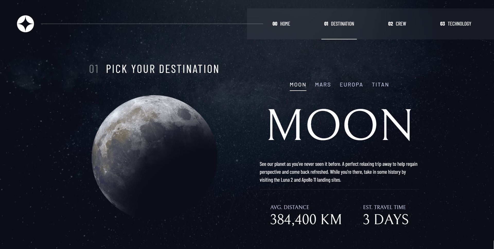
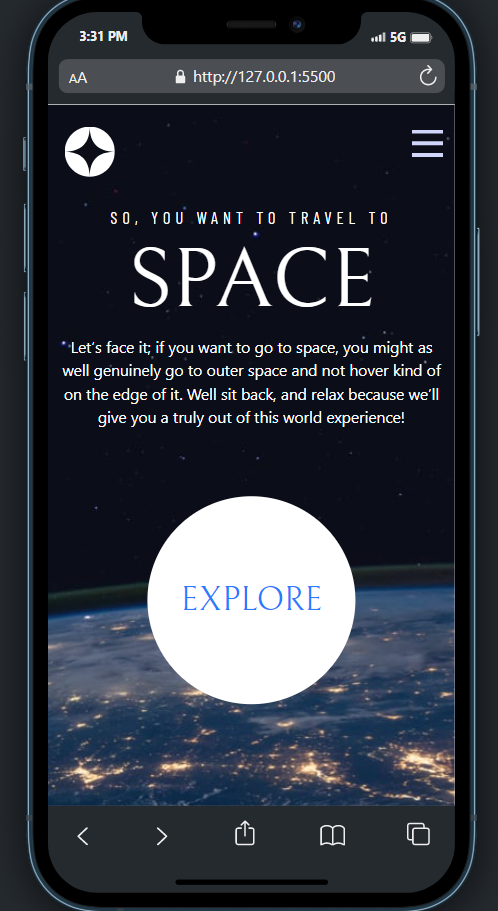

# Frontend Mentor - Space tourism website solution

This is a solution to the [Space tourism website challenge on Frontend Mentor](https://www.frontendmentor.io/challenges/space-tourism-multipage-website-gRWj1URZ3). Frontend Mentor challenges help you improve your coding skills by building realistic projects. 

## Table of contents

- [Overview](#overview)
  - [The challenge](#the-challenge)
  - [Screenshot](#screenshot)
  - [Links](#links)
- [My process](#my-process)
  - [Built with](#built-with)
  - [What I learned](#what-i-learned)
  - [Continued development](#continued-development)
- [Author](#author)

## Overview

### The challenge

Users should be able to:

- View the optimal layout for each of the website's pages depending on their device's screen size
- See hover states for all interactive elements on the page
- View each page and be able to toggle between the tabs to see new information

### Screenshot





### Links

- Solution URL: [Solution URL](https://github.com/ahmedfekry/ahmedfekry.github.io/tree/master/FrontendMentor/space-tourism-website-main)
- Live Site URL: [Live site ](https://ahmedfekry.github.io/FrontendMentor/space-tourism-website-main/index.html)

## My process

### Built with

- Semantic HTML5 markup
- CSS custom properties
- Flexbox
- CSS Grid
- Mobile-first workflow
- Bootstrap

### What I learned

1- I have practiced more on bootstrap and it's grid system
2- I have practiced more on grid css
3- i learned how to change the src of image using css


```html
  
```
```css
.img-fluid#vehicle-image{
        content: url(../images/technology/image-launch-vehicle-portrait.jpg);
    }
```
### Continued development

  I need to practice more on transations and animations
  

## Author

- Frontend Mentor - [@yourusername](https://www.frontendmentor.io/profile/ahmedfekry)
- Twitter - [@ahmedfikry78](https://www.twitter.com/ahmedfikry78)